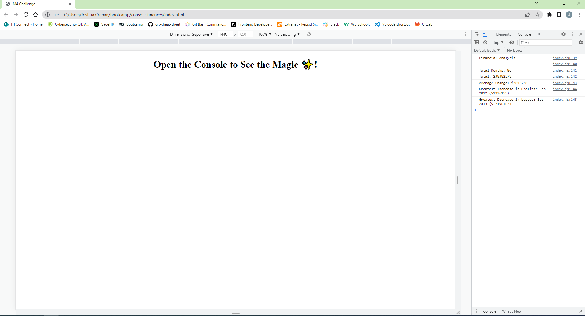

# console-finances

## Description
This challenge allowed me to showcase my JavaScript skills that I have learned in the previous week to solve a real-world  problem.

I was tasked to create code to analyse the financial records of a company. Please find a link to the deployed web page below.

https://jc6991.github.io/console-finances/

## Table of Contents
- [Installation](#Installation)
- [Usage](#Usage)
- [Credits](#Credits)
- [License](#License)

## Installation
N/A

## Usage
The user should open the console by right clicking and pressing "Inspect". The results are displayed in the console.

## Credits
N/A

## License
Please refer to the LICENSE in the repo.